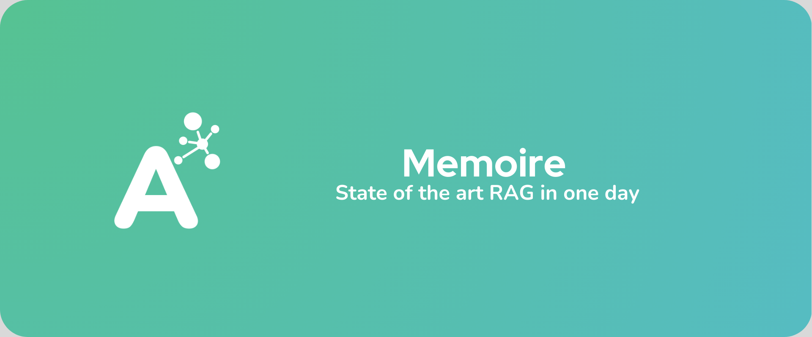
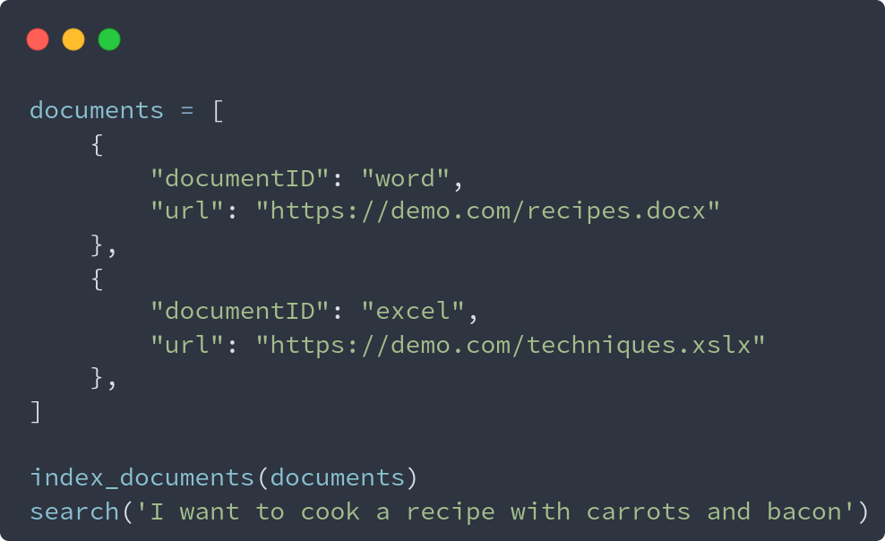

  
  <h1>Memoire is a self-hosted RAG-as-a-service to help you deploy AI faster </h1>

<!-- Badges -->

  
  
  
  

   
<h4>
    <a href="https://astarlogic.com/doc/memoire?utm_source=github&utm_medium=readme">Documentation</a>
   · 
    <a href="https://github.com/A-star-logic/memoire/issues/">Report Bug</a>
   · 
    <a href="https://github.com/A-star-logic/memoire/issues/">Request Feature</a>
  </h4>

## Features

- **Deploy in one day**: We made our API as intuitive as possible, so you can get a working RAG in a few minutes instead of months.
- **State of the art retrieval**: Benefit from the latest and best algorithms of retrieval such as hybrid search, agentic chunking, HyDE and many more.
- **Auto document parsing**: Forget about parsing html, xml, docx, pdfs and the gazillion document types out there. Memoire already does it for you.

  

### License & running the app

We are not open source yet. We have our [own source-available license you can read here](./LICENSE), the TLDR is:

- Today, you can use freely the software for hobby or educational purpose, but you need to pay a fee to deploy to production (we can negotiate this fee).
- Our goal is become default alive as quickly as possible.
- Once we are, the code will become open core.
- To buy a license, [book a call on our website](https://astarlogic.com?utm_source=github&utm_medium=readme)

## Get started

<a href="https://astarlogic.com/doc/memoire?utm_source=github&utm_medium=readme" target="_blank" alt="Go to Logto website"  align="center">
  

    
  

  

  <b>
    Documentation home
  </b>
  

</a>

## Github, contributing & issues

You are welcome to contribute to the repository, just look for open issues.

## Problems?

If you are facing issues with Memoire, depending on which plan you have:

- **You are a subscriber**: you should contact our team immediately, you already have our whatsapp. I will respond as soon as possible during working hours
- **You are not a subscriber**: please open a new issue, and tag @mael-abgrall, the maintainer of the repository
