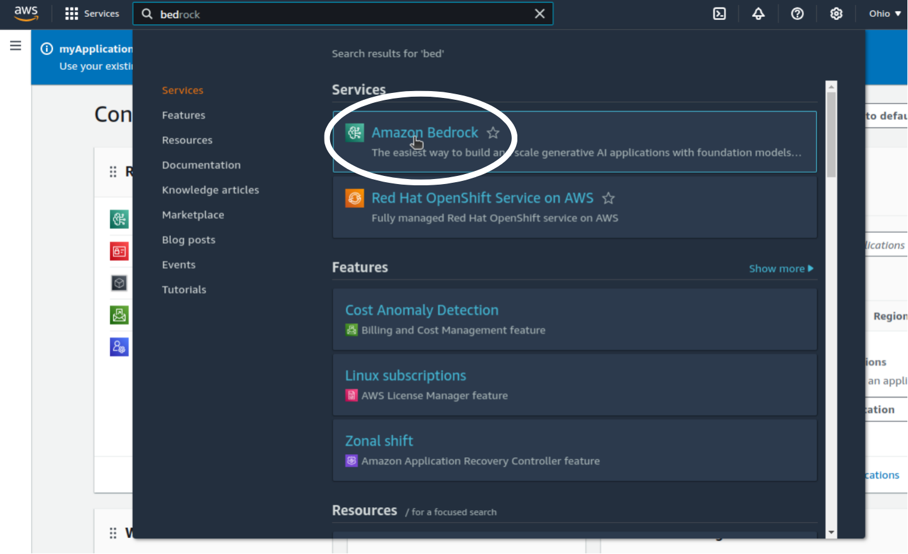
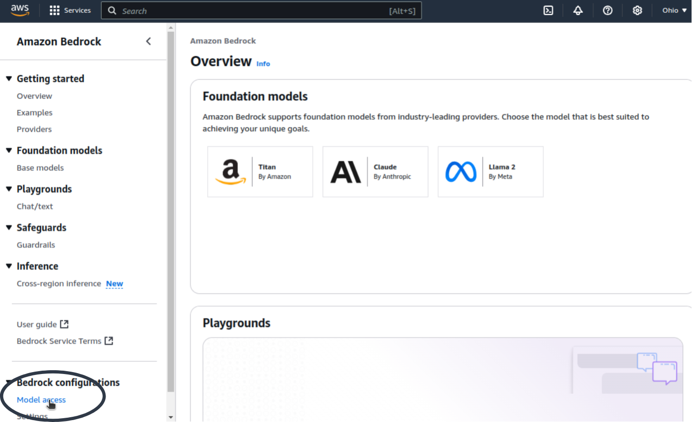
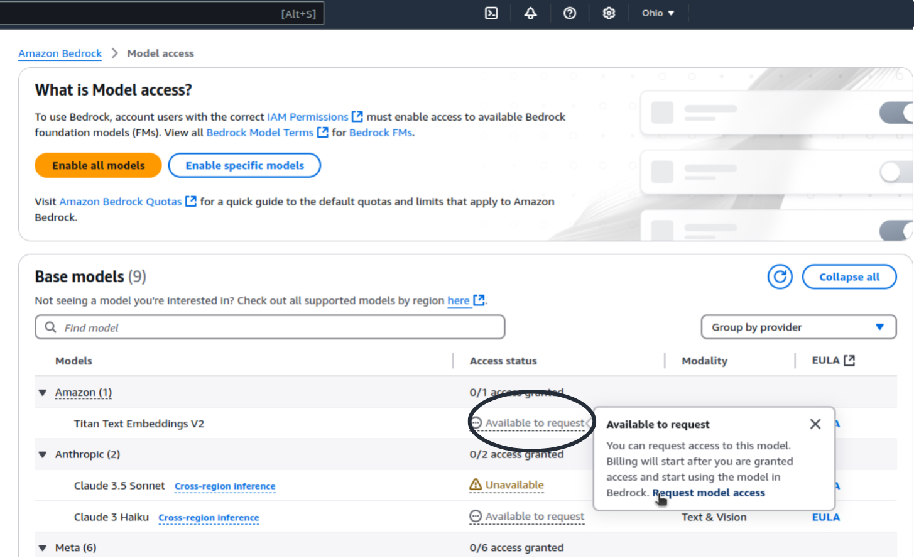
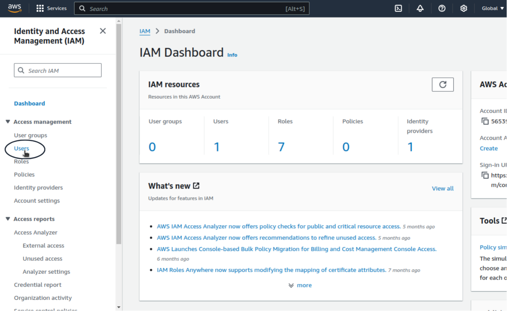
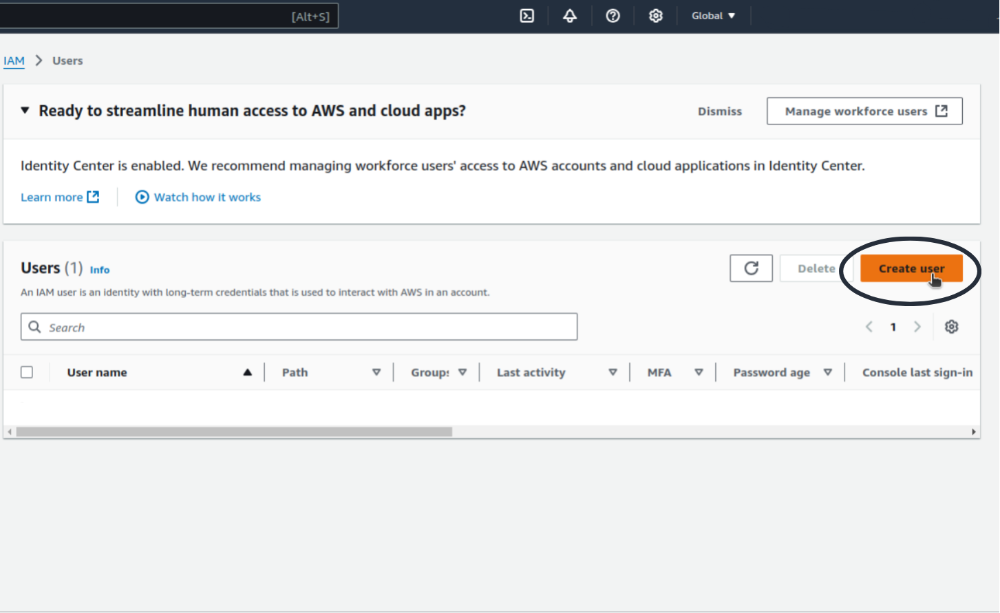
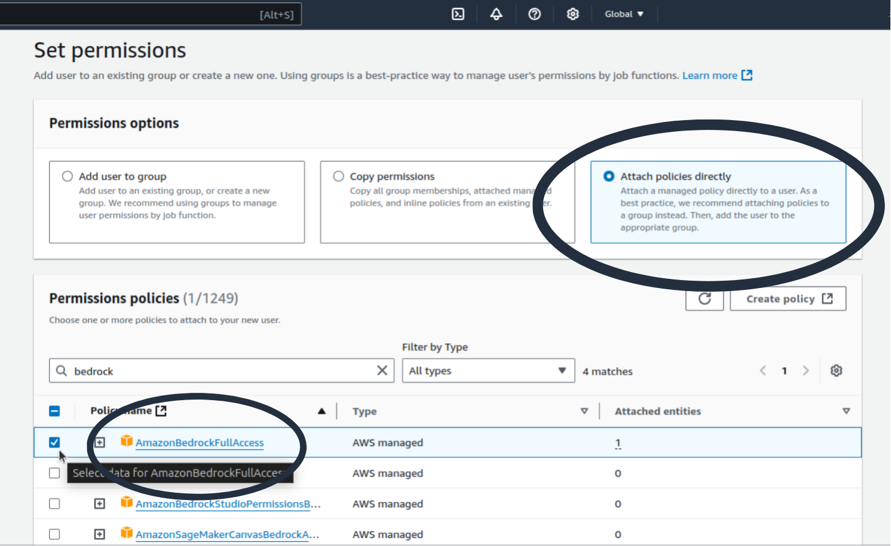
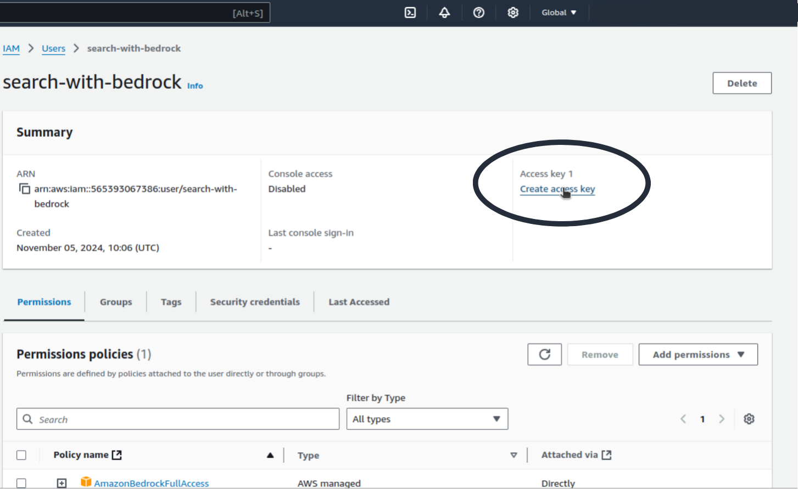

# Accessing Bedrock Models and Creating AWS Credentials

This will guide you how to select the model, and create aws credentials

## Prerequisites

Before you begin, ensure you have the following:

- An AWS account
- Access to the AWS Management Console

## Step 1: Request Access to Bedrock Models

1. **Sign in to the Amazon Bedrock Console**: Go to the [Amazon Bedrock Console](https://aws.amazon.com/bedrock).
<p align="center">
    
    <br>
    <em>Figure 1.1: AWS console bedrock search</em>
</p>

2. **Navigate to Model Access**: In the left navigation pane, under _Bedrock Configurations_, click on _Model Access_.
<p align="center">
    
    <br>
    <em>Figure 1.2: Bedrock model access navigation</em>
</p>

3. **Select the Model**: choose the model that you want to proceed with, and click on _Request model access_.
<p align="center">
    
    <br>
    <em>Figure 1.3: Selecting the model</em>
</p>

4. **Review and Submit**: Review your changes, read the terms, and click **Submit**, it will take less than couple of minutes for your request to get accepted.

## Step 2: Create IAM User and Access Keys

These access keys will be used as your env variables.

1. **Log into the AWS Console**: Sign in to the AWS Management Console and open the [IAM console](https://console.aws.amazon.com/iam).
2. **Create User**: Click _Users_ in the navigation pane, then _Create user_.
   - Enter a username.
   - Click _Next: Permissions_.

<p align="center">
    
    <br>
    <em>Figure 2.1.1: press on create user</em>
</p>
<p align="center">
    
    <br>
    <em>Figure 2.1.2: press on create user</em>
</p>

3. **Set Permissions**: Choose _Attach existing policies directly_. Select a policy `AmazonBedrockFullAccess`

<p align="center">
    
    <br>
    <em>Figure 2.2: Select policy</em>
</p>

5. **Create User**: Attach the policy to the user, then click _Next: Tags_ (optional), and _Create User_.

6. **Generate Access Keys**: Select the user, and click _Create access key_.
   - Download the CSV file containing the access key ID and secret access key. Save this file securely.

<p align="center">
    
    <br>
    <em>Figure 2.2: create the key</em>
</p>

7. **Seting up the environment variables**: Finally, set up the environament variables in the root dir as follows:
   ```
   AWS_REGION= # Should be the same region that you requested model access
   AWS_SECRET_ACCESS_KEY= # Secret access key generated for the user
   AWS_ACCESS_KEY_ID= # Access key generated for the user
   ```
